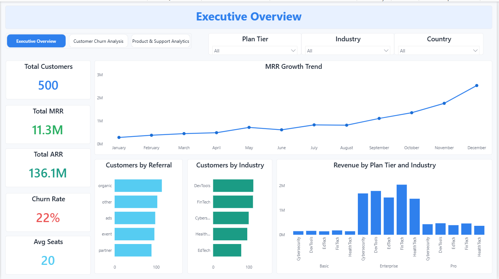
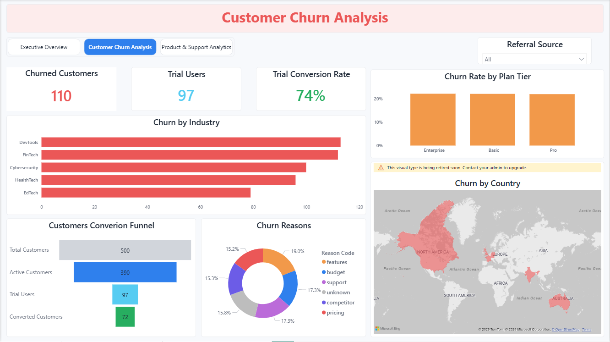
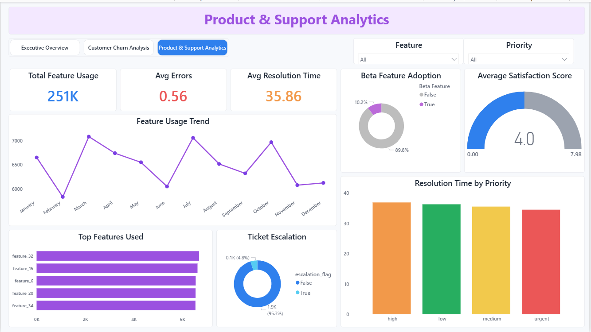

## SaaS Subscription & Churn Analytics Dashboard

**A production-ready SaaS analytics project designed to analyze revenue, churn behavior, product usage, and support performance using Python, PostgreSQL, and Power BI.**

---

## Table of Contents

- [Project Overview](#project-overview)
- [Business Problem](#business-problem)
- [Tech Stack](#tech-stack)
- [Key Features](#key-features)
- [Dashboard Results](#dashboard-results)
- [Dataset](#dataset)
- [Project Structure](#project-structure)
- [Data Pipeline](#data-pipeline)
- [SQL Analytics](#sql-analytics)
- [Power BI Dashboards](#power-bi-dashboards)
- [Key Insights](#key-insights)
- [Conclusion](#conclusion)
- [Future Work](#future-work)
- [Author](#author)

---

## Project Overview

This project delivers a **multi-page SaaS analytics dashboard** enabling businesses to:

**Monitor MRR & ARR growth.**

**Analyze customer churn patterns.**

**Track feature adoption & usage.**

**Evaluate support efficiency & satisfaction.**

Built using a modern analytics stack with a focus on scalability, modularity, and business impact.

---

## Business Problem

SaaS companies need visibility into:

Why customers churn?

Which plans drive revenue?

How users engage with the product?

How effective support operations are?

This project provides a centralized analytics layer + dashboard solution to answer these questions.

---

## Tech Stack

**Data Processing**

Python(Pandas, Numpy)

**Data Modeling**

PostgreSQL (SQL Views, Joins, Aggregations)

**Visualization**

Microsoft Power BI

---

## Key Features

End-to-end data pipeline (Python → PostgreSQL → Power BI).

Cleaned & validated multi-table dataset.

5 modular SQL views for scalable analytics.

KPI-driven dashboard design.

Revenue, churn, product & support analytics in one place.

---

## Dashboard Results

### Quick Stats from Actual Dashboards

|**Metric** | **Value** | **Dashboard** |
|----------|-----------|--------------|
| Total Customers | 500 | Executive Overview |
| Total MRR | $11.3M | Executive Overview |
| Total ARR | $136.1M | Executive Overview |
| Churn Rate | 22% | Executive Overview |
| Avg Seats | 21 | Executive Overview |
| Churned Customers | 110 | Churn Analysis |
| Trial Users | 97 | Churn Analysis |
| Trial Conversion Rate | 74% | Churn Analysis |
| Total Feature Usage | 251K | Product Analytics |
| Avg Errors | 0.56 | Product Analytics |
| Avg Resolution Time | 35.86 | Product Analytics |
| Avg Satisfaction Score | 4.0 | Product Analytics |

---

## Dataset

The data for this project is sourced from the Kaggle dataset:[Dataset](https://www.kaggle.com/datasets/rivalytics/saas-subscription-and-churn-analytics-dataset?)

SaaS Subscription and Churn Analytics Dataset

**Tables Used:**

accounts

subscriptions

churn_events

feature_usage

support_tickets

---

## Project Structure

```
SaaS-Subscriptions-And-Churn-Analytics-Dashboard/
│
├── data/
|   └── dataset.zip
├── notebooks/
|   └──SaaS_ETL_Pipeline.ipynb
├── sql/
│   ├── create_tables.sql
|   └── create_views.sql
├── dashboard/
|   ├──Executive_overview.png
|   ├──Customer_churn_analysis.png
│   └── Product_&_support_analytics.png
└── README.md
```

---

## Data Pipeline

**1️. Data Cleaning (Python)**

Removed duplicates

Handled missing values

Converted date formats

Standardized categorical fields

**2️. Data Modeling (PostgreSQL)**

Created structured tables

Built reusable SQL views

Performed joins across multiple tables

Applied aggregations for business metrics

**3️. Visualization (Power BI)**

Built interactive dashboards

Connected directly with SQL table + views

Created KPI cards and trend visuals

---

## SQL Analytics

### 5 Core SQL Views

1. **`executive_overview_view`**
- Total customers
- Total MRR & ARR
- Churn rate
- Average seats
  
2. **`mrr_growth_trend_view`**
- Monthly MRR trend
- Time-based revenue analysis
  
3. **`customer_segmentation_view`**
- Customers by industry
- Customers by referral source
  
4. **`churn_analysis_view`**
- Churn rate by industry
- Churn rate by plan tier

5. **`feature_performance_&_support_efficiency_view`**
- Feature usage metrics
- Average error rates
- Resolution time
- Customer satisfaction score

---

## Power BI Dashboards

### 1. Executive Overview



**Insights:**

Total customers: 500

MRR: 11.3M with strong upward trend

Enterprise plan generates the highest revenue contribution

Organic and referral channels drive most customer acquisition

Customer distribution is strong across multiple industries

---

### 2. Customer Churn Analysis



**Insights:**

Total churned customers: 110

Trial conversion rate: 74%

Higher churn observed in DevTools and FinTech industries

Churn rate is similar across plan tiers

Key churn drivers: pricing, features, and support issues

---

### 3. Product & Support Analytics



**Insights:**

Total feature usage: 251K

Feature usage trend shows consistent engagement with fluctuations

Average error rate is low (0.56) indicating stable product performance

Average resolution time: 35.86 hours

Satisfaction score: 4.0, indicating good support quality

Top features contribute significantly to overall usage

---

## Key Insights

Revenue is growing steadily, indicating strong business performance

Churn rate (~22%) highlights a clear retention opportunity

Some industries show higher churn risk and need attention

Feature usage is strong but not evenly distributed

Support performance is good but can be further optimized

---

## Future Work

Improve churn using predictive models

Optimize product adoption by improving low-usage features

Reduce support resolution time with better prioritization

Increase revenue via upselling & pricing optimization

Focus on high-churn industries with targeted retention strategies

---

## Author

Ashish Singh Kaurav

Email:[ashishsinghkauravda@gmail.com](mailto:ashishsinghkauravda@gmail.com)

[Linkedin](https://www.linkedin.com/in/ashishsinghkauravda-analyst)

[Github](https://github.com/ashishsinghkauravda-analyst)
